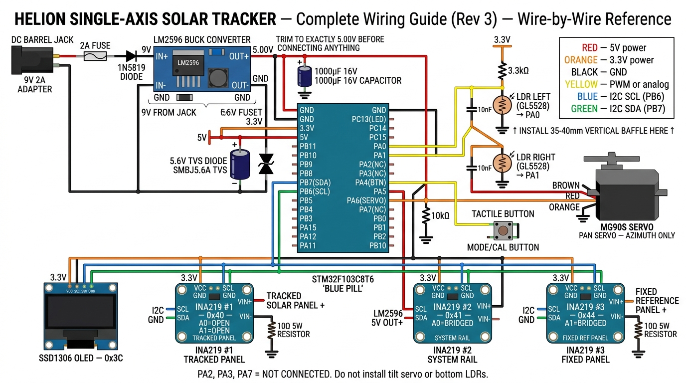

# ☀️ Helion — Single-Axis Solar Tracker & Telemetry System

[](https://www.st.com/en/microcontrollers-microprocessors/stm32f103c8.html)
[]()
[]()
[]()

**Helion** is an autonomous electro-mechanical **single-axis (azimuth) solar tracker** and multi-channel telemetry platform. It keeps a photovoltaic (PV) solar panel oriented perpendicular to incoming solar rays along the east–west axis while simultaneously recording **tracked energy generation**, **baseline static panel yield**, and **parasitic system power consumption**.

---

## 📸 Complete Wiring Guide

The diagram below is a **wire-by-wire connection reference** — accurate enough to build from directly. Color code: 🔴 Red = 5V, 🟠 Orange = 3.3V, ⚫ Black = GND, 🟡 Yellow = Signal, 🔵 Blue = I2C SCL, 🟢 Green = I2C SDA.



### Core Capabilities
* **Active Single-Axis Tracking:** East–West Pan (Azimuth) controlled by a metal-gear MG90S servo with continuous pulse-gated holding torque against wind gusts.
* **Normalized 2-LDR Sensing:** Left (PA0) and Right (PA1) LDRs with a center shadow baffle. Mathematical error normalization algorithm (±100% scale) immune to ambient room lighting, cloud cover, and seasonal brightness changes.
* **Triple INA219 Telemetry:** Simultaneous high-side voltage, current, and power logging over I²C (`0x40`: Tracked Panel, `0x41`: System Input Rail, `0x44`: Fixed Reference Panel).
* **Baseline Benchmarking:** Direct comparative yield tracking against an identical static solar panel using matched $10\ \Omega$ maximum power point load resistors.
* **Reverse Polarity, TVS & Surge Protection:** 3 A Schottky diode protection, 2 A fuse, 5.6 V overvoltage TVS clamp, low-ESR $1000\ \mu\text{F}$ inrush suppression bank, and isolated programmer lines with hardware NRST.

---

## 🛠️ Complete Bill of Materials (BOM)

| Item Description | Build Qty | Suggested Buy | Purpose & Selection Notes |
|:---|:---:|:---:|:---|
| **STM32F103C8T6 Blue Pill** | 1 | 2 | Main ARM Cortex-M3 controller board running @ 72 MHz |
| **ST-Link V2 Debugger** | 1 | 1 | Hardware SWD programmer (SWDIO, SWCLK, GND, and **NRST**) |
| **TowerPro MG90S Servo** | 1 | 2 | Metal-gear servo ($2.2\text{ kg}\cdot\text{cm}$) for Pan (Azimuth) |
| **GL5528 CdS LDR** | 2 | 4 | Left & Right light differential sensors with 35–40 mm center shadow baffle |
| **INA219 I²C Power Module** | 3 | 4 | Multi-drop power sensor with solder pads for A0/A1 addressing |
| **SSD1306 0.96″ OLED** | 1 | 1 | Real-time telemetry dashboard (128×64 resolution, address `0x3C`) |
| **6V 3W Polycrystalline Panel** | 2 | 2 | Matched pair (1× Tracked DUT, 1× Fixed Reference) |
| **10–12 Ω 5W Resistor** | 2 | 4 | MPP test load resistors matched within $\pm 0.1\ \Omega$ (heatsinked) |
| **LM2596 DC-DC Buck Converter** | 1 | 2 | High-efficiency step-down to regulated 5.00 V |
| **9 V 2 A DC Power Adapter** | 1 | 1 | Main system wall supply (5.5×2.1 mm center-positive) |
| **DC Barrel Jack (Female)** | 1 | 1 | Chassis socket with positive-line series slide switch & 2A fuse |
| **3 A Schottky Diode (SS34 / 1N5822)** | 1 | 3 | Reverse-polarity protection (3 A rated) |
| **5.6 V TVS Diode (1.5KE5.6A / SMBJ5.0A)**| 1 | 2 | Overvoltage clamp across 5V rail against buck regulator failure |
| **2 A Fuse (Glass/PPTC)** | 1 | 2 | Overcurrent protection against motor stalls |
| **Tactile Pushbutton** | 1 | 2 | PA4 user interface (Short = Mode Toggle, Long = Calibrate) |
| **3.3 kΩ – 4.7 kΩ Resistors** | 2 | 10 | LDR voltage dividers — one per LDR sensor (Left & Right) |
| **10 kΩ Resistor** | 1 | 5 | External servo signal pull-down (PA6) |
| **1000 µF 16V Electrolytic Cap** | 1 | 2 | Low-ESR inrush reservoir across 5V servo rail |

---

## 📌 Microcontroller Pin Mapping

| Pin Name | Function | Connected Component | Electrical Notes |
|:---|:---|:---|:---|
| **`PA0`** | `ADC1_IN0` | **Left** LDR Voltage Divider | **0 to 3.3 V strictly.** $10\text{ nF}$ filter cap to GND |
| **`PA1`** | `ADC1_IN1` | **Right** LDR Voltage Divider | **0 to 3.3 V strictly.** $10\text{ nF}$ filter cap to GND |
| **`PA2`** | *Not Used* | — | Leave unconnected (formerly Bottom-Left LDR) |
| **`PA3`** | *Not Used* | — | Leave unconnected (formerly Bottom-Right LDR) |
| **`PA4`** | `GPIO_Input` | Mode / Calibrate Button | Active-low pushbutton to GND (Internal pull-up) |
| **`PA6`** | `TIM3_CH1` | **Pan (Azimuth) Servo PWM** | External $10\text{ k}\Omega$ pull-down to GND required |
| **`PA7`** | *Not Used* | — | Leave unconnected (formerly Tilt Servo) |
| **`PB6`** | `I2C1_SCL` | Shared I²C SCL Bus Line | OLED (`0x3C`) + INA219s (`0x40`, `0x41`, `0x44`) |
| **`PB7`** | `I2C1_SDA` | Shared I²C SDA Bus Line | Shared 3.3 V I²C data line |
| **`PC13`** | `GPIO_Output` | Status LED | Active-low onboard LED |
| **`5V`**   | Power In | LM2596 Output (5.00V) | Must be trimmed to **$5.00\text{ V} \pm 0.05\text{ V}$** before connecting |
| **`3.3V`** | Power Out | Sensor & Display Rail | Sourced from onboard LDO (≤150 mA max) |

> [!IMPORTANT]
> **PA2, PA3, PA7 are no longer used.** Leave these pins unconnected. Do not connect the second servo (tilt) or the bottom LDRs — they are removed in this revision.

---

## 🔧 LDR & Baffle Placement

For a single-axis azimuth tracker, the two LDRs must be mounted with a **vertical center divider (shadow baffle)** between them:

```
        ┌──────────────────────────────────┐
        │     Solar Panel (top view)       │
        │                                  │
        │    ┌────────┬────────┐           │
        │    │  LEFT  │ RIGHT  │  ← LDRs  │
        │    │  (PA0) │ (PA1)  │           │
        │    └────────┴────────┘           │
        │         ↑ BAFFLE ↑               │
        └──────────────────────────────────┘
```

- The **baffle** casts a shadow on one LDR when the panel is off-angle, creating a strong differential signal.
- Without a baffle, both LDRs are equally lit near perpendicular, causing sluggish tracking.
- Recommended baffle height: **35–40 mm** above the LDR plane.

---

## 🖼️ Component Hardware Gallery

| Component | Hardware Photograph | Connection Summary |
|:---|:---:|:---|
| **STM32 Blue Pill** |  | Core MCU. Powered via 5V pin from LM2596. SWD debugging uses SWDIO, SWCLK, GND only. |
| **INA219 Power Module** |  | High-side current/voltage monitor. Address configured via A0/A1 solder bridges. |
| **MG90S Servo** |  | Metal-gear micro servo. Orange = Signal (PA6), Red = 5V Rail, Brown = GND. **Single servo only.** |
| **LM2596 Buck Converter** |  | Multi-turn trimmer adjusts 7-12V input down to regulated 5.00 V system power. |
| **SSD1306 OLED** |  | 128×64 pixel display on I²C address `0x3C`. Powered from 3.3 V rail. |
| **Protection Hardware** |  | 1N5819 Schottky diode + 2A glass fuse + DC barrel jack socket. |

---

## 🔌 Detailed Wiring Schematics

### 1. 2-LDR Sensor Voltage Divider (Left & Right)


### 2. Multi-Drop I²C Telemetry Bus


### 3. Solar Panel Power Measurement Path


---

## 📚 Complete Project Documentation

This repository contains exhaustive engineering documentation, design reviews, firmware, and test suites:

1. 📖 **[Solar Tracker: Complete Hardware Engineering Manual & Implementation Guide](solar_tracker_hardware_manual.md)**
   * System Block Architecture & Mathematical Models
   * Optical Shadow Baffle Geometry & Photometric Curves
   * Single-Axis Mechanical Design & Bearing Notes
   * Circuit Wiring Rules, Overvoltage TVS Protection & Resistor Selection

2. 🔍 **[Hardware Audit & Wiring Verification Report](hardware_audit_report.md)**
   * Component-by-Component Bench Assembly & Connection Verification Checklist

3. 🛠️ **[Corrected Design Notes & Hardware Fixes (Rev 3)](FIXES.md)**
   * Single-axis redesign change log
   * Safe bring-up order with per-step pass/fail criteria

4. 💻 **[Production Firmware Source Code](Core/)**
   * Production-grade STM32 HAL C codebase (`Core/Src/main.c`, `Core/Inc/`)
   * SSD1306 OLED framebuffer & 8-line live dashboard
   * DWT cycle counter delay for 20 ms / 50 Hz mains-hum rejection
   * Boot-time I²C scanner, servo soft-start, runaway protection, dawn sweep

5. 🧪 **[Host Unit Testing Suite](tests/)**
   * PC host test suite running against a mock HAL
   * Validates INA219 telemetry math, azimuth controller, runaway detector, and dashboard

---

## ⚡ Quick Start & Pre-Power Commissioning

1. **Continuity & Short Check:** With power OFF, verify with a multimeter that `5V`, `3.3V`, and `GND` are completely isolated from each other.
2. **Trim Power Output:** Connect 9 V supply to LM2596 input with nothing attached to output. Measure with DMM. Adjust trimmer until reading exactly **$5.00\text{ V} \pm 0.05\text{ V}$**.
3. **Flash MCU:** Connect ST-Link V2 using `SWDIO`, `SWCLK`, `GND`, and `NRST`. *Do NOT connect the ST-Link 3.3V wire when powered via LM2596.* Flash the firmware from `Core/`.
4. **Set I²C Addresses:**
   * INA219 #1 (Tracked Panel): Leave A0 & A1 open (`0x40`)
   * INA219 #2 (System Power): Bridge **A0** (`0x41`)
   * INA219 #3 (Fixed Panel): Bridge **A1** (`0x44`)
5. **Verify I²C Bus Scan:** Confirm all 4 devices (`0x3C`, `0x40`, `0x41`, `0x44`) are detected on startup.
6. **Connect Servo Last:** Power servo via a current-limited bench supply set to 1 A initially to verify smooth initialization.
7. **Calibrate Sensors:** Hold button on `PA4` for >2s under **uniform lighting** (point both LDRs at an even sky/lamp) to store relative LDR offset calibration factors.

---

## 👤 Author & License

* **Developer:** Muhammed Shifan ([@Bit-wisely](https://github.com/Bit-wisely))
* **Repository:** [https://github.com/Bit-wisely/helion.git](https://github.com/Bit-wisely/helion.git)
* **License:** MIT License — Open source for hardware developers and research applications.
