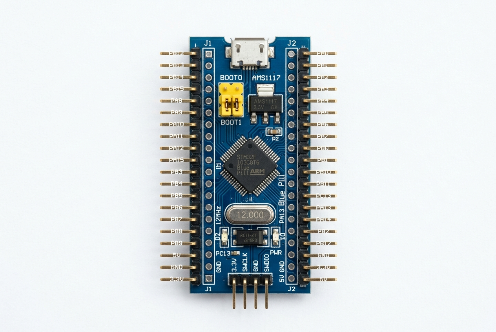
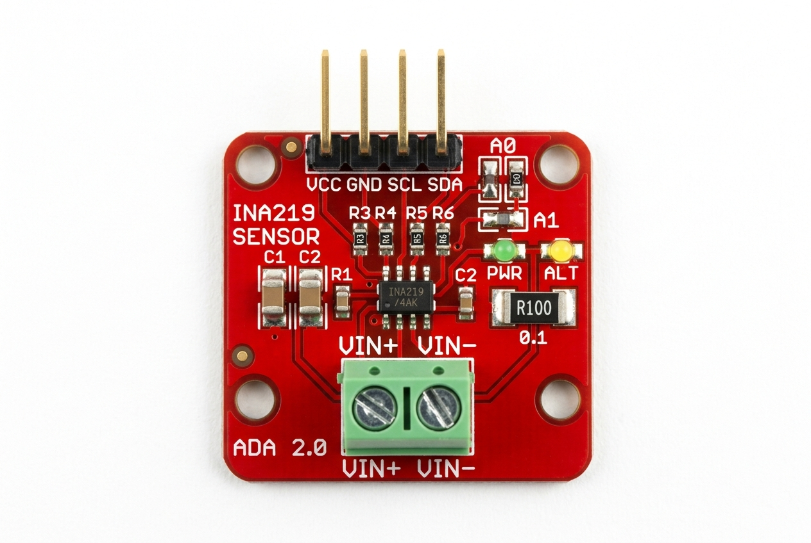
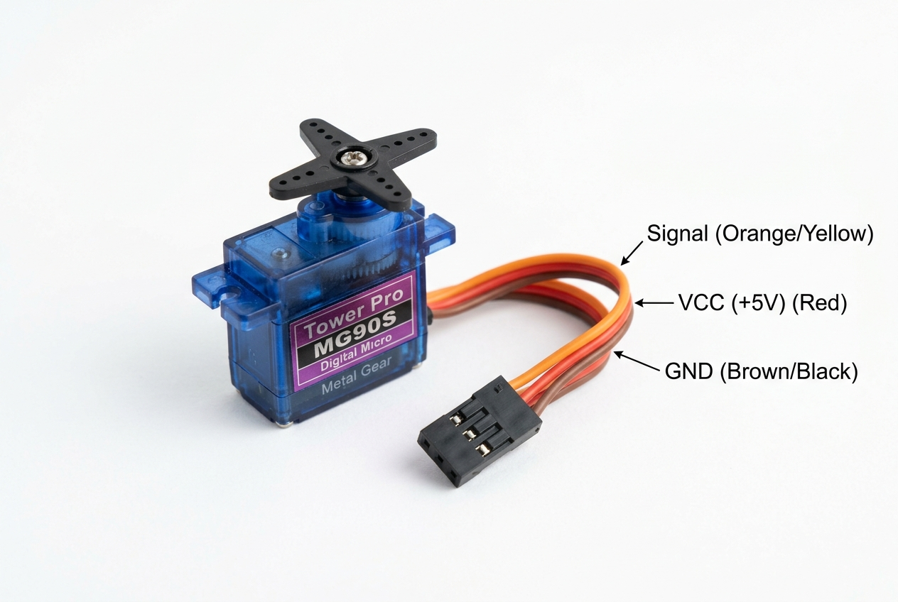
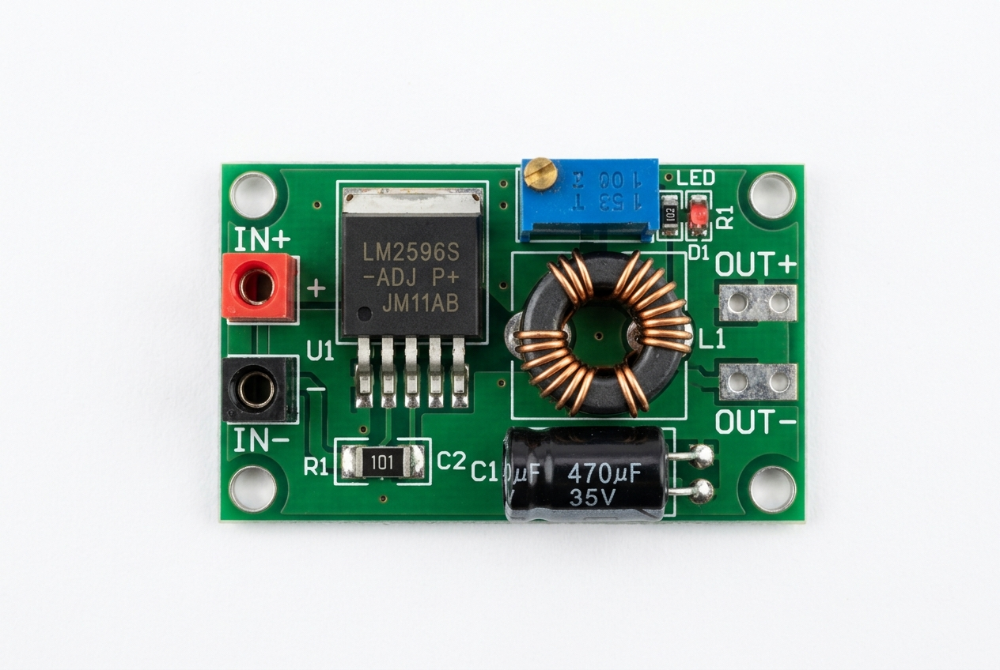
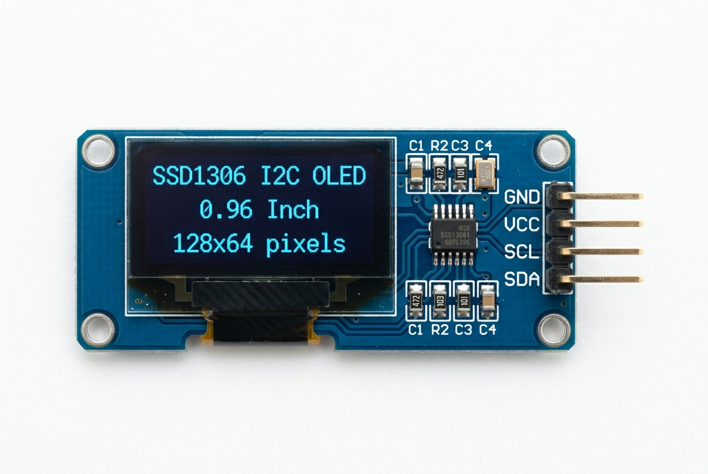
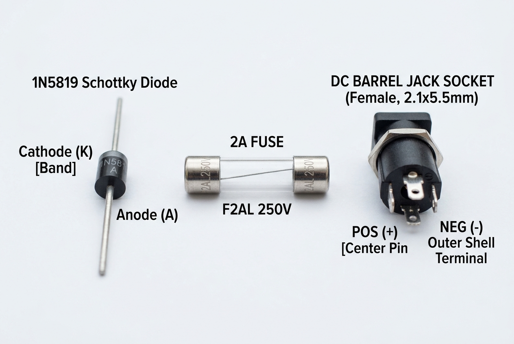
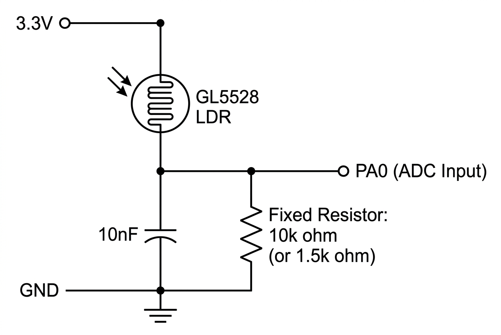
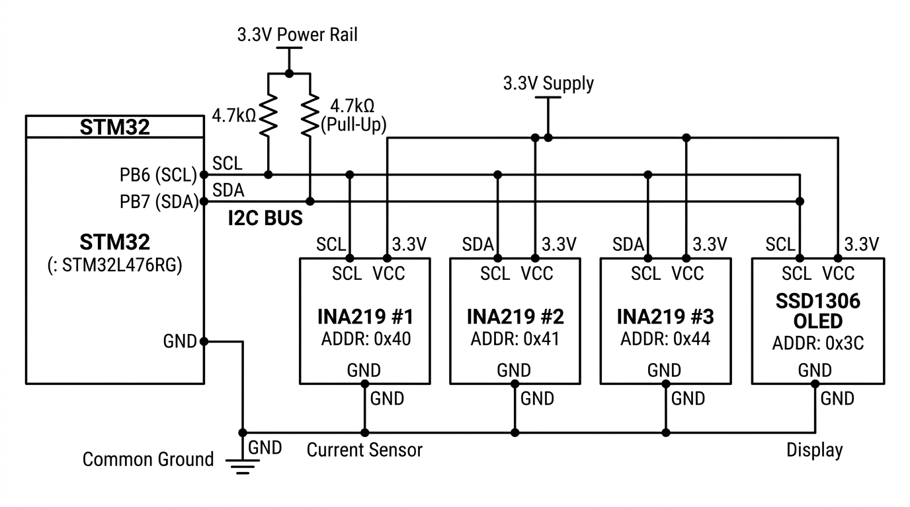
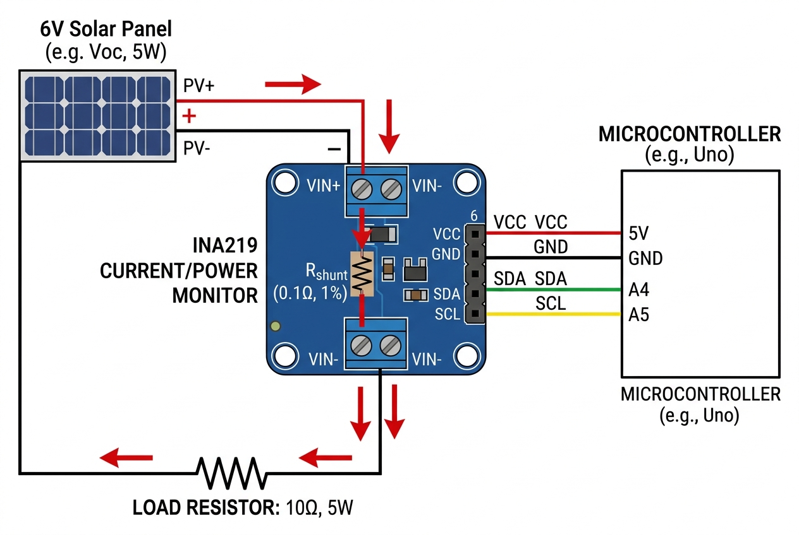
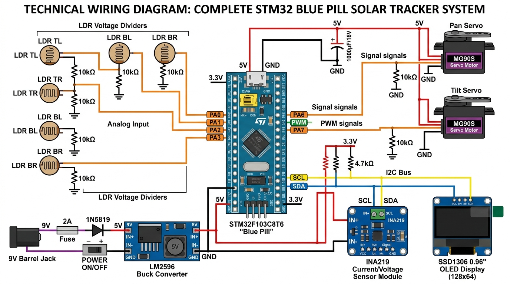

# 🔍 Dual-Axis Solar Tracker — Hardware Audit Report

**Document Scope:** Complete engineering audit of [solar_tracker_hardware_manual.md](solar_tracker_hardware_manual.md) covering electrical faults, firmware bugs, wiring errors, compatibility issues, and implementation barriers.

**Severity Legend:**
| 🔴 CRITICAL | Will destroy hardware or prevent operation |
|:---|:---|
| 🟠 HIGH | System will malfunction or produce wrong data |
| 🟡 MEDIUM | Works but with degraded reliability or accuracy |
| 🟢 LOW | Best-practice improvement |

---

## Component Reference Images

Before diving into the audit findings, these reference photos show the exact components and their pin labels for all wiring connections in this project.

---

### STM32F103C8T6 Blue Pill Board



**Key connections for this project:**
| Blue Pill Pin | Wire To | Function |
|:---|:---|:---|
| `PA0` – `PA3` | LDR divider midpoints | ADC analog inputs (0–3.3 V only) |
| `PA4` | Pushbutton → GND | Mode toggle / calibration (internal pull-up) |
| `PA6` | Pan servo signal (orange wire) | TIM3_CH1 PWM, with 10 kΩ pull-down to GND |
| `PA7` | Tilt servo signal (orange wire) | TIM3_CH2 PWM, with 10 kΩ pull-down to GND |
| `PB6` | I²C SCL bus line | Shared clock for OLED + 3× INA219 |
| `PB7` | I²C SDA bus line | Shared data for OLED + 3× INA219 |
| `PC13` | (Onboard LED) | Status indicator (active-low) |
| `5V` | LM2596 OUT+ | Main 5.00 V supply input |
| `GND` | Star ground point | Common return for all subsystems |
| `3.3V` | LDRs, INA219 VCC, OLED VCC | Onboard LDO output (≤150 mA) |

> [!CAUTION]
> **ST-Link header:** When powered from the barrel jack, connect only `SWDIO`, `SWCLK`, and `GND`. **Never** connect the ST-Link's 3.3 V wire simultaneously.
> **Micro-USB:** Never plug in USB while the `5V` pin is externally powered.

---

### INA219 I²C Current/Power Sensor Module



**Address configuration via solder bridges:**
| Module | Function | A0 | A1 | 7-bit Address |
|:---|:---|:---:|:---:|:---:|
| INA219 #1 | Tracked PV panel | Open | Open | `0x40` |
| INA219 #2 | System power rail | **Bridged** | Open | `0x41` |
| INA219 #3 | Fixed reference panel | Open | **Bridged** | `0x44` |

> [!IMPORTANT]
> Power the VCC pin from **3.3 V**, not 5 V, so the I²C bus levels stay at 3.3 V. The INA219 chip itself operates from 3.0–5.5 V, and its VIN+ bus voltage input can measure up to 26 V independently.

---

### MG90S Micro Servo — Wire Color Code



| Wire Color | Function | Connect To |
|:---|:---|:---|
| **Orange/Yellow** | PWM Signal | PA6 (pan) or PA7 (tilt) via jumper wire |
| **Red** | +5 V Power | Servo power rail on perfboard (NOT the Blue Pill 5V pin!) |
| **Brown/Black** | Ground | Star ground on perfboard |

> [!WARNING]
> Servo power (red wire) must come from the dedicated 5 V perfboard rail with the 1000 µF capacitor, **not** directly from the Blue Pill's 5V pin. The Blue Pill's thin PCB traces cannot handle the 1.3 A peak servo stall current.

---

### LM2596 DC-DC Buck Converter Module



**Connections:**
| Terminal | Wire To |
|:---|:---|
| `IN+` | Output of 1N5819 diode cathode (after fuse + diode) |
| `IN-` | Star ground point |
| `OUT+` | 5 V servo power rail AND Blue Pill `5V` pin |
| `OUT-` | Star ground point |

> [!CAUTION]
> **Pre-trim this module before connecting anything!** These modules ship in random states. Connect your DMM across OUT+/OUT-, apply 9 V to IN+/IN-, and carefully turn the potentiometer screw while watching the meter until it reads **5.00 V ± 0.05 V**. Then lock the screw with adhesive.

---

### SSD1306 0.96" I²C OLED Display



| Pin | Wire To |
|:---|:---|
| `GND` | Star ground |
| `VCC` | Blue Pill **3.3 V** (not 5 V!) |
| `SCL` | PB6 (shared I²C bus) |
| `SDA` | PB7 (shared I²C bus) |

> [!NOTE]
> Some OLED modules have pin order `VCC, GND, SCL, SDA` while others use `GND, VCC, SCL, SDA`. **Check your specific module's silkscreen** before wiring — reversing VCC/GND will damage the OLED driver.

---

### Protection Components — Diode, Fuse & Barrel Jack



**Power input chain wiring order:**

```
DC Barrel Jack (+) → Slide Switch → 2A Fuse → 1N5819 Anode(A) → 1N5819 Cathode(K) → INA219 #2 VIN+ → INA219 #2 VIN- → LM2596 IN+
DC Barrel Jack (−) → Star GND
```

> [!IMPORTANT]
> The silver/grey **band** on the 1N5819 marks the **cathode** (output side). Current flows from anode → cathode. If installed backwards, the diode blocks all power and nothing turns on (safe failure). If the diode is shorted or bypassed, you lose reverse-polarity protection.

---

### LDR Voltage Divider Circuit



Build **four identical copies** of this circuit for PA0, PA1, PA2, PA3. The LDR connects from the 3.3 V rail to the ADC pin. The fixed resistor (10 kΩ indoor / 1.5 kΩ outdoor) connects from the ADC pin to GND. The 10 nF ceramic capacitor sits between the ADC pin and GND for noise filtering.

---

### I²C Bus Architecture — All Devices on Shared Bus



All four I²C devices share the same two-wire bus. External 4.7 kΩ pull-ups are needed **only if none of the modules have onboard pull-ups**. Most INA219 and OLED modules already include 10 kΩ onboard pull-ups — check before adding external ones, as too many pull-ups in parallel lower the effective resistance and can prevent proper I²C communication.

---

### Solar Panel → INA219 → Load Resistor Measurement Chain



The INA219 measures current via its onboard 0.1 Ω shunt resistor between VIN+ and VIN−. The **bus voltage** is measured at VIN− relative to GND. The current path is: Panel (+) → VIN+ → shunt → VIN− → 10 Ω load → Panel (−) → GND.

> [!IMPORTANT]
> The panel's negative terminal and the INA219's GND pin must both connect to the **same common star ground** as the rest of the system, or the bus voltage reading will be incorrect.

---

### Complete System Wiring Overview



---

# PART 1: Critical & High-Severity Findings

---

## 🔴 ISSUE 1 — Firmware Bug: INA219 System Rail Read Overwrites All Fields

**Location:** [main.c, line 642](solar_tracker_hardware_manual.md#L642)

```c
// BUG: All three parameters point to the SAME variable
INA219_ReadData(INA219_ADDR_SYSTEM, &telemetry.p_system, &telemetry.p_system, &telemetry.p_system);
```

**Problem:** The function `INA219_ReadData()` writes voltage, current, and power to three separate float pointers. Passing `&telemetry.p_system` for all three means:
1. Voltage is written to `p_system`
2. Current overwrites `p_system`
3. Power overwrites `p_system` again

Only the last-written value (power) survives. **System voltage and system current are lost.**

**Fix:** Add `v_system` and `i_system` fields to the `SystemTelemetry` struct:
```c
typedef struct {
    // ... existing fields ...
    float v_system;  // ADD THIS
    float i_system;  // ADD THIS
    float p_system;
    // ...
} SystemTelemetry;

// Corrected call:
INA219_ReadData(INA219_ADDR_SYSTEM, &telemetry.v_system, &telemetry.i_system, &telemetry.p_system);
```

---

## 🔴 ISSUE 2 — Missing `HAL_ADC_MspInit` / `HAL_TIM_MspInit` / `HAL_I2C_MspInit`

**Location:** The firmware contains `MX_ADC1_Init()`, `MX_TIM3_Init()`, `MX_I2C1_Init()`, and `MX_GPIO_Init()` but is **missing all MSP (MCU Support Package) initialization callbacks**.

**Problem:** The HAL `HAL_ADC_Init()`, `HAL_TIM_PWM_Init()`, and `HAL_I2C_Init()` functions internally call their respective `HAL_xxx_MspInit()` weak callbacks. These callbacks are responsible for:
- Enabling the peripheral clock (`__HAL_RCC_ADC1_CLK_ENABLE()`, etc.)
- Configuring GPIO pins to their alternate function mode (e.g., PA6/PA7 as TIM3_CH1/CH2 AF push-pull, PB6/PB7 as I2C1 open-drain)

**Without these callbacks, no peripheral will actually function.** The ADC won't convert, the timer won't output PWM, and I²C won't communicate.

**Fix:** Add the three MSP init functions. In a CubeMX project, these are auto-generated in `stm32f1xx_hal_msp.c`. For bare-metal, add:

```c
void HAL_ADC_MspInit(ADC_HandleTypeDef* hadc) {
    if (hadc->Instance == ADC1) {
        __HAL_RCC_ADC1_CLK_ENABLE();
        // PA0-PA3 are analog by default after reset, no GPIO config needed
    }
}

void HAL_TIM_PWM_MspInit(TIM_HandleTypeDef* htim) {
    if (htim->Instance == TIM3) {
        __HAL_RCC_TIM3_CLK_ENABLE();
        GPIO_InitTypeDef GPIO_InitStruct = {0};
        GPIO_InitStruct.Pin = GPIO_PIN_6 | GPIO_PIN_7;
        GPIO_InitStruct.Mode = GPIO_MODE_AF_PP;
        GPIO_InitStruct.Speed = GPIO_SPEED_FREQ_LOW;
        HAL_GPIO_Init(GPIOA, &GPIO_InitStruct);
    }
}

void HAL_I2C_MspInit(I2C_HandleTypeDef* hi2c) {
    if (hi2c->Instance == I2C1) {
        __HAL_RCC_I2C1_CLK_ENABLE();
        GPIO_InitTypeDef GPIO_InitStruct = {0};
        GPIO_InitStruct.Pin = GPIO_PIN_6 | GPIO_PIN_7;
        GPIO_InitStruct.Mode = GPIO_MODE_AF_OD;
        GPIO_InitStruct.Speed = GPIO_SPEED_FREQ_HIGH;
        HAL_GPIO_Init(GPIOB, &GPIO_InitStruct);
    }
}
```

---

## 🔴 ISSUE 3 — Missing `Error_Handler()` Function

**Location:** Not present anywhere in the firmware.

**Problem:** The STM32 HAL framework calls `Error_Handler()` when any peripheral initialization fails (e.g., `HAL_RCC_OscConfig` returns `HAL_ERROR`). Without this function defined, the linker will fail with an "undefined reference" error and **the firmware will not compile**.

**Fix:**
```c
void Error_Handler(void) {
    __disable_irq();
    while (1) {
        HAL_GPIO_TogglePin(GPIOC, GPIO_PIN_13); // Blink LED as error signal
        for (volatile uint32_t i = 0; i < 500000; i++);
    }
}
```

---

## 🔴 ISSUE 4 — OLED Display Has No Text Rendering

**Location:** [main.c lines 534–572](solar_tracker_hardware_manual.md#L534-L572)

**Problem:** The OLED driver only implements `OLED_Init()`, `OLED_Clear()`, and `OLED_WriteCommand()`. There is **no function to render text or numbers on the display**. The firmware initializes and clears the OLED, but never writes any telemetry data to it. The OLED will remain blank forever.

The manual claims the OLED serves as a "Real-time telemetry dashboard (displays comparative mW, mAh, tracking error, and system status)" but this functionality is completely unimplemented.

**Fix:** Add a font table (5×7 pixel font), a `OLED_WriteString()` function, a `OLED_SetCursor()` function, and a dashboard rendering routine called from the main telemetry loop. This is a significant amount of code (~100–200 lines for a minimal font + rendering).

---

## 🟠 ISSUE 5 — INA219 Configuration Register Value Unverified

**Location:** [main.c line 501](solar_tracker_hardware_manual.md#L501)

```c
uint8_t cfg[3] = {0x00, 0x39, 0x9F}; // Comment says: 32V, 320mV Shunt, 12-bit Continuous
```

**Problem:** Decoding `0x399F` against the INA219 datasheet register map (Register 0x00):

| Bits | Field | Binary | Value |
|:---|:---|:---|:---|
| 15–13 | RST, — | `001` | No reset |
| 12–11 | BRNG | `11` | **Bus voltage range = 32 V** ✅ |
| 10–9 | PG | `00` | **Shunt voltage range = ±40 mV (Gain /1)** ❌ |
| 8–3 | BADC/SADC | `011001` | Mixed ADC settings |
| 2–0 | MODE | `111` | Continuous shunt+bus ✅ |

The comment says "320 mV shunt" (Gain /8) but the register value sets PG = `00`, which is ±40 mV (Gain /1). With a 0.1 Ω shunt, Gain /1 limits the measurable current to:

$$I_{\max} = \frac{40\text{ mV}}{0.1\text{ Ω}} = 400\text{ mA}$$

The panel's maximum power point current is ~520 mA, which **exceeds the shunt measurement range** and will clip/saturate.

**Fix:** Set PG = `11` for ±320 mV (Gain /8):
```c
uint8_t cfg[3] = {0x00, 0x3F, 0x9F}; // 32V bus, ±320mV shunt (Gain /8), 12-bit, continuous
```

---

## 🟠 ISSUE 6 — INA219 Calibration Register Value Incorrect

**Location:** [main.c line 504](solar_tracker_hardware_manual.md#L504)

```c
uint8_t cal[3] = {0x05, 0x10, 0x00}; // Comment says: Cal = 4096 for 0.1 Ohm shunt
```

**Problem:** `0x1000` = 4096 decimal. The INA219 calibration register formula is:

$$\text{Cal} = \text{trunc}\left(\frac{0.04096}{\text{Current\_LSB} \times R_{\text{shunt}}}\right)$$

With `Current_LSB = 0.1 mA = 0.0001 A` and `R_shunt = 0.1 Ω`:

$$\text{Cal} = \text{trunc}\left(\frac{0.04096}{0.0001 \times 0.1}\right) = \text{trunc}(4096) = 4096$$

This matches ✅ if Gain /8 is set. **However**, the code doesn't use the calibration register at all — it reads raw shunt voltage (register 0x01) and manually converts:

```c
*current_ma = (float)raw_shunt * 0.1f;
```

With Gain /1 (±40 mV), the shunt voltage LSB is 10 µV, so `raw_shunt * 10 µV / 0.1 Ω = raw_shunt * 0.1 mA`. This works mathematically for Gain /1, but clips at 400 mA as noted above.

**With the corrected Gain /8 config**, the LSB stays at 10 µV, so the same formula still works — it just won't clip anymore. The calibration register write is harmless but unused.

---

## 🟠 ISSUE 7 — Spin-Wait Delay Is Clock-Dependent and Inaccurate

**Location:** [main.c line 384](solar_tracker_hardware_manual.md#L384)

```c
for(volatile int d = 0; d < 700; d++); // ~500 us spin-wait at 72 MHz
```

**Problem:** This loop's actual duration depends on compiler optimization level, instruction cache state, and flash wait states. At `-O0` (debug), each iteration takes ~15–20 cycles. At `-O2` (release), the loop body compiles differently. The actual timing could be anywhere from 200 µs to 900 µs.

The manual claims "40 samples over exactly 20 ms (500 µs intervals)" for mains-hum rejection (50 Hz). If the total window isn't close to 20 ms, the hum rejection is degraded.

**Fix:** Use a hardware timer or `HAL_Delay(1)` (1 ms minimum) or `DWT_Delay_us(500)` using the DWT cycle counter:

```c
// DWT microsecond delay (exact on Cortex-M3)
static inline void DWT_Delay_us(uint32_t us) {
    uint32_t start = DWT->CYCCNT;
    uint32_t ticks = us * (SystemCoreClock / 1000000);
    while ((DWT->CYCCNT - start) < ticks);
}
```

---

## 🟠 ISSUE 8 — Night Parking Threshold Uses ADC Counts, Not Lux

**Location:** [main.c lines 323–324](solar_tracker_hardware_manual.md#L323-L324)

```c
#define NIGHT_ENTER_LUX  300  // Below this sum -> Enter night park
#define NIGHT_EXIT_LUX   550  // Above this sum -> Resume tracking
```

**Problem:** The variable names say "LUX" but these values are compared against `total_light`, which is the **sum of four ADC readings** (each 0–4095). Four ADC channels summed gives a range of 0–16380. A threshold of 300 means "enter night parking when the sum of all four ADC values is below 300" — that's when each channel averages below 75 counts out of 4095, which corresponds to about 0.06 V per channel. This is extremely dark — essentially only deep night or a covered sensor head.

**The threshold is probably too low for practical dusk detection**, and the naming is misleading.

**Fix:** Rename the defines to `NIGHT_ENTER_ADC_SUM` / `NIGHT_EXIT_ADC_SUM` and calibrate the values experimentally. A reasonable dusk threshold might be 1000–2000 (sum of four channels).

---

## 🟠 ISSUE 9 — Demo Mode Never Stops PWM (Continuous Servo Buzz)

**Location:** [main.c lines 464–476](solar_tracker_hardware_manual.md#L464-L476)

```c
if (moved) {
    HAL_TIM_PWM_Start(&htim3, TIM_CHANNEL_1);
    HAL_TIM_PWM_Start(&htim3, TIM_CHANNEL_2);
    __HAL_TIM_SET_COMPARE(&htim3, TIM_CHANNEL_1, pan_pulse);
    __HAL_TIM_SET_COMPARE(&htim3, TIM_CHANNEL_2, tilt_pulse);

    if (current_mode == MODE_FIELD) {
        HAL_Delay(400);
        HAL_TIM_PWM_Stop(&htim3, TIM_CHANNEL_1);
        HAL_TIM_PWM_Stop(&htim3, TIM_CHANNEL_2);
    }
    // Demo mode: PWM is never stopped!
}
```

**Problem:** In `MODE_DEMO`, PWM starts but is never stopped. The servos receive continuous PWM signals indefinitely. This causes:
- Constant servo buzz/whine from the PID loop inside the servo trying to hold position
- Continuous power draw of ~10–50 mA per servo (even when not moving)
- Mechanical gear wear from constant micro-adjustments

**Fix:** Add a delay and stop even in demo mode:
```c
if (moved) {
    HAL_TIM_PWM_Start(&htim3, TIM_CHANNEL_1);
    HAL_TIM_PWM_Start(&htim3, TIM_CHANNEL_2);
    __HAL_TIM_SET_COMPARE(&htim3, TIM_CHANNEL_1, pan_pulse);
    __HAL_TIM_SET_COMPARE(&htim3, TIM_CHANNEL_2, tilt_pulse);

    uint32_t settle_ms = (current_mode == MODE_FIELD) ? 400 : 250;
    HAL_Delay(settle_ms);
    HAL_TIM_PWM_Stop(&htim3, TIM_CHANNEL_1);
    HAL_TIM_PWM_Stop(&htim3, TIM_CHANNEL_2);
}
```

---

## 🟠 ISSUE 10 — System Rail INA219 Placement is Wrong

**Location:** [Block diagram, line 18](solar_tracker_hardware_manual.md#L18) and [Section 7 text](solar_tracker_hardware_manual.md#L253)

**Problem in the block diagram:**
```
DIODE --> INA_SYS["INA219 #2 (0x41) System Rail Sensor"] --> LM2596
```

The INA219 #2 is placed **before** the LM2596 buck converter (on the raw 7–9 V input side). This measures the **input** current and voltage to the buck converter, not the actual system consumption.

**Why this matters:**
- The bus voltage reading will be ~8.5 V (9 V minus diode drop), not the 5 V system rail
- The current measured is the *input* current to the buck. Due to the buck converter's efficiency (~85%), the input current is lower than the output current: $I_{\text{in}} = \frac{V_{\text{out}} \times I_{\text{out}}}{V_{\text{in}} \times \eta}$
- Power measurement ($V_{\text{bus}} \times I_{\text{shunt}}$) will be approximately correct for total system power, but voltage and current individually are misleading

**If the goal is to measure system power consumption**, this placement actually works (input power ≈ output power / efficiency). But the manual should clarify this is measuring **input** power, not rail power.

**Alternative:** Place INA219 #2 on the LM2596 output side (between OUT+ and the distribution point) to measure actual 5 V rail current directly.

---

## 🟠 ISSUE 11 — Button Debounce Blocks Main Loop

**Location:** [main.c lines 615–626](solar_tracker_hardware_manual.md#L615-L626)

```c
if (HAL_GPIO_ReadPin(GPIOA, GPIO_PIN_4) == GPIO_PIN_RESET) {
    uint32_t press_time = HAL_GetTick();
    while (HAL_GPIO_ReadPin(GPIOA, GPIO_PIN_4) == GPIO_PIN_RESET) {
        HAL_Delay(10);
    }
    // ...
}
```

**Problem:** This `while` loop **blocks the entire main loop** until the button is released. During a long press (2+ seconds for calibration), no tracking, no telemetry, and no servo updates occur. If a button gets stuck or shorted to ground, the system hangs permanently.

**Fix:** Use a non-blocking state machine:
```c
static uint32_t btn_press_start = 0;
static bool btn_was_pressed = false;

if (HAL_GPIO_ReadPin(GPIOA, GPIO_PIN_4) == GPIO_PIN_RESET) {
    if (!btn_was_pressed) {
        btn_press_start = HAL_GetTick();
        btn_was_pressed = true;
    }
} else if (btn_was_pressed) {
    uint32_t duration = HAL_GetTick() - btn_press_start;
    btn_was_pressed = false;
    if (duration > 2000) Calibrate_Sensor_Offsets();
    else if (duration > 50) current_mode = (current_mode == MODE_DEMO) ? MODE_FIELD : MODE_DEMO;
}
```

---

# PART 2: Medium & Low-Severity Findings

---

## 🟡 ISSUE 12 — 3.3 V LDO Current Budget Is Tight

**Location:** [Pinout Table, line 145](solar_tracker_hardware_manual.md#L145)

The manual states "150 mA max" for the Blue Pill's onboard 3.3 V LDO. Actual current budget:

| Load | Current Draw |
|:---|:---|
| STM32F103C8T6 @ 72 MHz | ~30–50 mA |
| SSD1306 OLED (typical) | ~20–30 mA |
| 3× INA219 modules | ~3 mA total |
| 4× LDR dividers (at ~1 kΩ / 10 kΩ) | ~1.3 mA total |
| **Total** | **~54–84 mA** |

This is within the 150 mA limit but leaves only ~66–96 mA of headroom. The genuine AMS1117-3.3 is rated at 800 mA, but many Blue Pill clones use **cheaper LDOs** (sometimes unmarked) that may only deliver 100–150 mA with poor thermal regulation.

**Recommendation:** If the OLED display flickers or the MCU resets during servo actuation (ground bounce coupling into the 3.3 V rail), add a **100 µF electrolytic + 100 nF ceramic** capacitor across the 3.3 V rail near the OLED.

---

## 🟡 ISSUE 13 — Servo Pulse Limits May Not Match Physical Range

**Location:** [main.c lines 315–318](solar_tracker_hardware_manual.md#L315-L318)

```c
#define PAN_MIN_PULSE   600
#define PAN_MAX_PULSE   2400
#define TILT_MIN_PULSE  800
#define TILT_MAX_PULSE  2200
```

**Problem:** The user previously noted that "1000–2000 µs is often only about 90–110° of real movement on SG90/MG90S, not 180°." The manual uses 600–2400 µs for pan, which is an extremely wide range. Many MG90S servos will mechanically bind or stall at these extremes, drawing maximum current and potentially damaging the gears.

**Fix:** Before connecting the panel, sweep each servo individually with a test program, starting from 1000 µs and slowly widening the range while listening for grinding or stalling. Set the limits to 50 µs inside the point where binding begins.

---

## 🟡 ISSUE 14 — ADC Channel 0 Missing 10 nF Filter Cap in Pinout Table

**Location:** [Pinout Table, line 131](solar_tracker_hardware_manual.md#L131)

```
| PA0 | Pin 10 | ADC1_IN0 | Top-Left LDR Divider | 0 to 3.3 V strictly. Not 5 V tolerant. |
```

PA0 is the only ADC pin whose notes column does **not** mention the "10 nF filter cap to GND" that PA1, PA2, and PA3 all specify. The BOM lists 4× 10 nF caps, and the LDR circuit diagram shows the cap, so this is likely just a documentation omission. But if someone follows only the pinout table, PA0 won't get filtered.

**Fix:** Add "10 nF filter cap to GND" to the PA0 notes column.

---

## 🟡 ISSUE 15 — Calibration Offsets Stored Only in RAM

**Location:** [main.c lines 480–497](solar_tracker_hardware_manual.md#L480-L497)

**Problem:** The `cal_factors[4]` array is stored in RAM and initialized to `{1.0, 1.0, 1.0, 1.0}`. After a power cycle, the calibration is lost and must be repeated.

**Recommendation:** For field use, store calibration factors in the STM32's internal Flash memory (pages 62–63 on the F103C8) so they persist across reboots. Alternatively, auto-calibrate on every power-up during a 3-second delay.

---

## 🟡 ISSUE 16 — mAh Accumulation Has First-Iteration Error

**Location:** [main.c lines 636–645](solar_tracker_hardware_manual.md#L636-L645)

```c
if (now - last_telemetry_tick >= 500) {
    float dt_hours = (now - last_telemetry_tick) / 3600000.0f;
    last_telemetry_tick = now;
    // ...
    telemetry.mah_tracked += (telemetry.i_tracked * dt_hours);
}
```

**Problem:** On the very first iteration, `last_telemetry_tick` is 0 (initialized at line 607). If the system has been running for, say, 2 seconds before the first telemetry read, `dt_hours` = 2000/3600000 = 0.000556 hours. The `i_tracked` value used is the *current* reading, but it's multiplied by a `dt` that spans the entire startup period — during which no valid current was flowing.

**Fix:** Initialize `last_telemetry_tick = HAL_GetTick()` immediately before the main loop, or skip the mAh accumulation on the first iteration:

```c
uint32_t last_telemetry_tick = HAL_GetTick(); // Fix: init to current time
```

---

## 🟡 ISSUE 17 — INA219 Bus Voltage Calculation Uses Non-Standard Formula

**Location:** [main.c lines 514–516](solar_tracker_hardware_manual.md#L514-L516)

```c
int16_t raw_v = (int16_t)((data[0] << 8) | data[1]);
*voltage = (float)((raw_v >> 3) * 4) * 0.001f;
```

**Analysis:** The INA219 bus voltage register (0x02) has bits [15:3] containing the voltage value and bits [2:0] containing flags (CNVR, OVF, reserved). The LSB of the shifted value is 4 mV.

- `raw_v >> 3` extracts the voltage field
- `* 4` scales by 4 mV per LSB
- `* 0.001f` converts from mV to V

This is correct ✅, but the intermediate calculation `(raw_v >> 3) * 4` can overflow for a signed 16-bit value if `raw_v >> 3` exceeds 8191 (which represents 32.764 V — unlikely for a 6 V panel but possible for the 9 V system rail).

**Fix:** Cast to `int32_t` before multiplication:
```c
*voltage = (float)(((int32_t)(raw_v >> 3)) * 4) * 0.001f;
```

---

## 🟢 ISSUE 18 — I²C Pull-Up Resistor Stacking Risk

**Location:** [Section 7, line 242](solar_tracker_hardware_manual.md#L242) and [BOM line 80](solar_tracker_hardware_manual.md#L80)

**Problem:** The BOM lists 4.7 kΩ pull-ups as "optional (fit only if bus modules lack onboard pull-ups)" but doesn't provide a diagnostic procedure. Most cheap INA219 modules (CJMCU, GY-219) and SSD1306 OLED modules include **10 kΩ onboard pull-ups**.

With 3 INA219s + 1 OLED, all with 10 kΩ pull-ups, the effective pull-up resistance per line is:

$$R_{\text{eff}} = \frac{10\text{k}}{4} = 2.5\text{ kΩ}$$

Adding external 4.7 kΩ on top gives:

$$R_{\text{eff}} = \frac{1}{\frac{4}{10000} + \frac{1}{4700}} \approx 1.7\text{ kΩ}$$

At 3.3 V with 1.7 kΩ, the I²C sink current requirement is:

$$I_{\text{sink}} = \frac{3.3\text{ V}}{1.7\text{ kΩ}} \approx 1.94\text{ mA}$$

The STM32 GPIO can sink up to 25 mA, so electrically this is safe. But the rise time becomes very fast, potentially causing signal integrity issues on long wires.

**Recommendation:** Before adding external pull-ups, run an I²C scan. If all four devices are detected, the onboard pull-ups are sufficient. Only add external pull-ups if devices fail to respond.

---

## 🟢 ISSUE 19 — No Watchdog Timer Configured

**Problem:** The firmware has no Independent Watchdog (IWDG) or Window Watchdog (WWDG) configured. If the main loop hangs (e.g., I²C bus lockup, button stuck low), the system stops tracking and never recovers until manual power cycle.

**Fix:** Enable the IWDG with a 2-second timeout:
```c
IWDG_HandleTypeDef hiwdg;
hiwdg.Instance = IWDG;
hiwdg.Init.Prescaler = IWDG_PRESCALER_64;
hiwdg.Init.Reload = 1250; // ~2 seconds at 40 kHz LSI
HAL_IWDG_Init(&hiwdg);

// In main loop, kick the watchdog:
HAL_IWDG_Refresh(&hiwdg);
```

---

## 🟢 ISSUE 20 — Block Diagram Shows INA219 #2 Placement Inconsistently

**Location:** [Block diagram lines 18–19](solar_tracker_hardware_manual.md#L18-L19)

The Mermaid block diagram shows:
```
DIODE --> INA_SYS --> LM2596
```

But [Section 7.1 text](solar_tracker_hardware_manual.md#L253) describes INA219 #2 as measuring "Barrel Rail to LM2596."

The wiring order in the protection chain should be documented unambiguously:

```
Barrel Jack (+) → Switch → Fuse → 1N5819 → INA219 #2 VIN+ → VIN− → LM2596 IN+
```

Make it clear this measures **input-side** power and voltage (pre-buck), not the 5 V output rail.

---

## 🟢 ISSUE 21 — `abs()` Used On `int32_t` — Should Use `labs()`

**Location:** [main.c lines 442, 453](solar_tracker_hardware_manual.md#L442-L453)

```c
if (abs(err_azimuth) > DEADBAND_PERCENT) {
```

**Problem:** `abs()` from `<stdlib.h>` is defined for `int` arguments. On ARM Cortex-M3 with most compilers, `int` and `int32_t` are both 32-bit, so this works in practice. However, the C standard only guarantees `abs()` for `int`. Using `labs()` (for `long`) or casting explicitly is more portable.

**Fix:** Minor, but use `labs()` or a ternary:
```c
if ((err_azimuth > 0 ? err_azimuth : -err_azimuth) > DEADBAND_PERCENT) {
```

---

## 🟢 ISSUE 22 — No I²C Bus Recovery Mechanism

**Problem:** The STM32F1 I²C peripheral is notorious for bus lockups (the "I²C busy flag stuck" errata). If a slave device holds SDA low during a transaction abort, the entire I²C bus hangs until power cycle.

**Recommendation:** Add an I²C bus recovery routine that bit-bangs 9 clock pulses on SCL before initializing I²C, and call it if `HAL_I2C_Master_Transmit` returns `HAL_BUSY` or `HAL_TIMEOUT`:

```c
void I2C_Bus_Recovery(void) {
    // Temporarily set PB6 as GPIO output and toggle 9 clocks
    GPIO_InitTypeDef g = {0};
    g.Pin = GPIO_PIN_6;
    g.Mode = GPIO_MODE_OUTPUT_OD;
    g.Speed = GPIO_SPEED_FREQ_LOW;
    HAL_GPIO_Init(GPIOB, &g);
    
    for (int i = 0; i < 9; i++) {
        HAL_GPIO_WritePin(GPIOB, GPIO_PIN_6, GPIO_PIN_RESET);
        HAL_Delay(1);
        HAL_GPIO_WritePin(GPIOB, GPIO_PIN_6, GPIO_PIN_SET);
        HAL_Delay(1);
    }
    // Re-init I2C
    HAL_I2C_DeInit(&hi2c1);
    MX_I2C1_Init();
}
```

---

## 🟢 ISSUE 23 — Baffle Height Inconsistency

**Location:** [Section 5.3, line 183](solar_tracker_hardware_manual.md#L183) vs. [Block diagram, line 35](solar_tracker_hardware_manual.md#L35) vs. [BOM, line 89](solar_tracker_hardware_manual.md#L89)

- Block diagram line 35: "35mm Matte Baffle"
- Section 5.3 line 183: "35–40 mm tall baffle"
- BOM line 89: "35–40 mm tall cross divider"

**Minor inconsistency.** The block diagram says 35 mm but the text and BOM say 35–40 mm. Standardize on "35–40 mm" everywhere.

---

# PART 3: Wiring Verification Checklist

Use this checklist during assembly to verify every connection before power-on.

| # | Connection | From | To | Wire Color / Type | Verified? |
|:---:|:---|:---|:---|:---|:---:|
| 1 | Barrel jack (+) | Center pin | Slide switch terminal 1 | Red 18 AWG | ☐ |
| 2 | Switch output | Switch terminal 2 | Fuse holder terminal 1 | Red 18 AWG | ☐ |
| 3 | Fuse output | Fuse holder terminal 2 | 1N5819 anode (no band side) | Red 18 AWG | ☐ |
| 4 | Diode output | 1N5819 cathode (band side) | INA219 #2 VIN+ | Red 18 AWG | ☐ |
| 5 | System sense output | INA219 #2 VIN− | LM2596 IN+ | Red 18 AWG | ☐ |
| 6 | Barrel jack (−) | Outer shell | Star ground point | Black 18 AWG | ☐ |
| 7 | LM2596 IN− | IN− terminal | Star ground point | Black 18 AWG | ☐ |
| 8 | LM2596 OUT+ | OUT+ terminal | 5V bus (perfboard rail) | Red 20 AWG | ☐ |
| 9 | LM2596 OUT− | OUT− terminal | Star ground point | Black 20 AWG | ☐ |
| 10 | Blue Pill 5V | 5V header pin | 5V bus on perfboard | Red Dupont | ☐ |
| 11 | Blue Pill GND | GND header pin | Star ground point | Black Dupont | ☐ |
| 12 | 1000 µF cap (+) | Positive leg (longer) | 5V bus rail | — | ☐ |
| 13 | 1000 µF cap (−) | Negative leg (stripe) | Star ground | — | ☐ |
| 14 | 100 nF cap | Across 5V–GND on servo rail | — | — | ☐ |
| 15 | Pan servo red | Red wire | 5V bus on perfboard | — | ☐ |
| 16 | Pan servo brown | Brown wire | Star ground | — | ☐ |
| 17 | Pan servo orange | Orange wire | PA6 via jumper | Orange Dupont | ☐ |
| 18 | Tilt servo red | Red wire | 5V bus on perfboard | — | ☐ |
| 19 | Tilt servo brown | Brown wire | Star ground | — | ☐ |
| 20 | Tilt servo orange | Orange wire | PA7 via jumper | Orange Dupont | ☐ |
| 21 | PA6 pull-down | 10 kΩ from PA6 | GND | Resistor | ☐ |
| 22 | PA7 pull-down | 10 kΩ from PA7 | GND | Resistor | ☐ |
| 23 | LDR TL | 3.3V → LDR → PA0 → 10k/1.5k → GND | + 10nF cap PA0–GND | — | ☐ |
| 24 | LDR TR | 3.3V → LDR → PA1 → 10k/1.5k → GND | + 10nF cap PA1–GND | — | ☐ |
| 25 | LDR BL | 3.3V → LDR → PA2 → 10k/1.5k → GND | + 10nF cap PA2–GND | — | ☐ |
| 26 | LDR BR | 3.3V → LDR → PA3 → 10k/1.5k → GND | + 10nF cap PA3–GND | — | ☐ |
| 27 | Button | PA4 → button → GND | (internal pull-up) | — | ☐ |
| 28 | INA219 #1 VCC | VCC pin | Blue Pill 3.3V | Red Dupont | ☐ |
| 29 | INA219 #1 GND | GND pin | Star ground | Black Dupont | ☐ |
| 30 | INA219 #1 SCL | SCL pin | PB6 bus | Yellow Dupont | ☐ |
| 31 | INA219 #1 SDA | SDA pin | PB7 bus | Green Dupont | ☐ |
| 32 | INA219 #1 VIN+ | Screw terminal | Tracked panel (+) | Red 20 AWG | ☐ |
| 33 | INA219 #1 VIN− | Screw terminal | Load resistor #1 leg A | Red 20 AWG | ☐ |
| 34 | Load R #1 return | Load resistor #1 leg B | Panel (−) → Star GND | Black 20 AWG | ☐ |
| 35 | INA219 #2 VCC | VCC pin | Blue Pill 3.3V | Red Dupont | ☐ |
| 36 | INA219 #2 GND | GND pin | Star ground | Black Dupont | ☐ |
| 37 | INA219 #2 SCL | SCL pin | PB6 bus | Yellow Dupont | ☐ |
| 38 | INA219 #2 SDA | SDA pin | PB7 bus | Green Dupont | ☐ |
| 39 | INA219 #2 A0 | Solder bridge | **Bridged** (address 0x41) | Solder blob | ☐ |
| 40 | INA219 #3 VCC | VCC pin | Blue Pill 3.3V | Red Dupont | ☐ |
| 41 | INA219 #3 GND | GND pin | Star ground | Black Dupont | ☐ |
| 42 | INA219 #3 SCL | SCL pin | PB6 bus | Yellow Dupont | ☐ |
| 43 | INA219 #3 SDA | SDA pin | PB7 bus | Green Dupont | ☐ |
| 44 | INA219 #3 A1 | Solder bridge | **Bridged** (address 0x44) | Solder blob | ☐ |
| 45 | INA219 #3 VIN+ | Screw terminal | Fixed panel (+) | Red 20 AWG | ☐ |
| 46 | INA219 #3 VIN− | Screw terminal | Load resistor #2 leg A | Red 20 AWG | ☐ |
| 47 | Load R #2 return | Load resistor #2 leg B | Panel (−) → Star GND | Black 20 AWG | ☐ |
| 48 | OLED VCC | VCC pin | Blue Pill 3.3V | Red Dupont | ☐ |
| 49 | OLED GND | GND pin | Star ground | Black Dupont | ☐ |
| 50 | OLED SCL | SCL pin | PB6 bus | Yellow Dupont | ☐ |
| 51 | OLED SDA | SDA pin | PB7 bus | Green Dupont | ☐ |

---

# Summary of All Findings

| # | Severity | Category | Issue |
|:---:|:---:|:---|:---|
| 1 | 🔴 | Firmware | System rail INA219 read overwrites all three fields with same pointer |
| 2 | 🔴 | Firmware | Missing HAL MSP init callbacks — no peripheral clocks or GPIO alt-function setup |
| 3 | 🔴 | Firmware | Missing `Error_Handler()` — code won't compile |
| 4 | 🔴 | Firmware | OLED has no text rendering — display stays blank forever |
| 5 | 🟠 | Firmware | INA219 config register sets Gain /1 (±40 mV) — clips at 400 mA, panel delivers 520 mA |
| 6 | 🟠 | Firmware | INA219 calibration register written but never used (harmless but confusing) |
| 7 | 🟠 | Firmware | Spin-wait loop timing is compiler/optimization dependent |
| 8 | 🟠 | Firmware | Night parking thresholds labeled "LUX" but compared against raw ADC sum |
| 9 | 🟠 | Firmware | Demo mode never stops PWM — servos buzz continuously |
| 10 | 🟠 | Electrical | System INA219 placed on input side of buck — measures input power, not 5V rail |
| 11 | 🟠 | Firmware | Button handler blocks main loop during press |
| 12 | 🟡 | Electrical | 3.3V LDO current budget is tight on cheap clone boards |
| 13 | 🟡 | Mechanical | Servo pulse limits (600–2400 µs) may exceed physical safe range |
| 14 | 🟡 | Documentation | PA0 missing 10 nF cap note in pinout table |
| 15 | 🟡 | Firmware | Calibration offsets lost on power cycle (RAM only) |
| 16 | 🟡 | Firmware | mAh accumulation first-iteration error due to `last_telemetry_tick = 0` |
| 17 | 🟡 | Firmware | Bus voltage intermediate calc could overflow on 9V rail readings |
| 18 | 🟢 | Electrical | I²C pull-up stacking risk with 4 modules + external resistors |
| 19 | 🟢 | Firmware | No watchdog timer — system never recovers from hangs |
| 20 | 🟢 | Documentation | Block diagram INA219 #2 placement description is ambiguous |
| 21 | 🟢 | Firmware | `abs()` used on `int32_t` — should be `labs()` for portability |
| 22 | 🟢 | Firmware | No I²C bus recovery mechanism for the known STM32F1 I²C errata |
| 23 | 🟢 | Documentation | Baffle height inconsistent between diagram (35 mm) and text (35–40 mm) |

> [!IMPORTANT]
> **Issues 1–4 are compilation/runtime blockers.** The firmware will not compile (Issue 3), and even if patched, the OLED stays blank (Issue 4), system telemetry is corrupted (Issue 1), and no peripheral actually initializes (Issue 2). Fix all four before flashing.

> [!TIP]
> **Recommended first-power-on sequence after fixing the firmware:**
> 1. Trim LM2596 to 5.00 V (DMM on OUT+/OUT−, no loads connected)
> 2. Connect Blue Pill only (no servos, no I²C devices) — verify 3.3 V pin reads 3.30 V
> 3. Flash firmware via ST-Link (SWDIO + SWCLK + GND only)
> 4. Connect LDR dividers — verify PA0–PA3 read 0.1–3.1 V with flashlight
> 5. Connect OLED and INA219s — run I²C scan, verify 0x3C, 0x40, 0x41, 0x44
> 6. Connect servos last — verify no resets, check 1000 µF cap is installed
